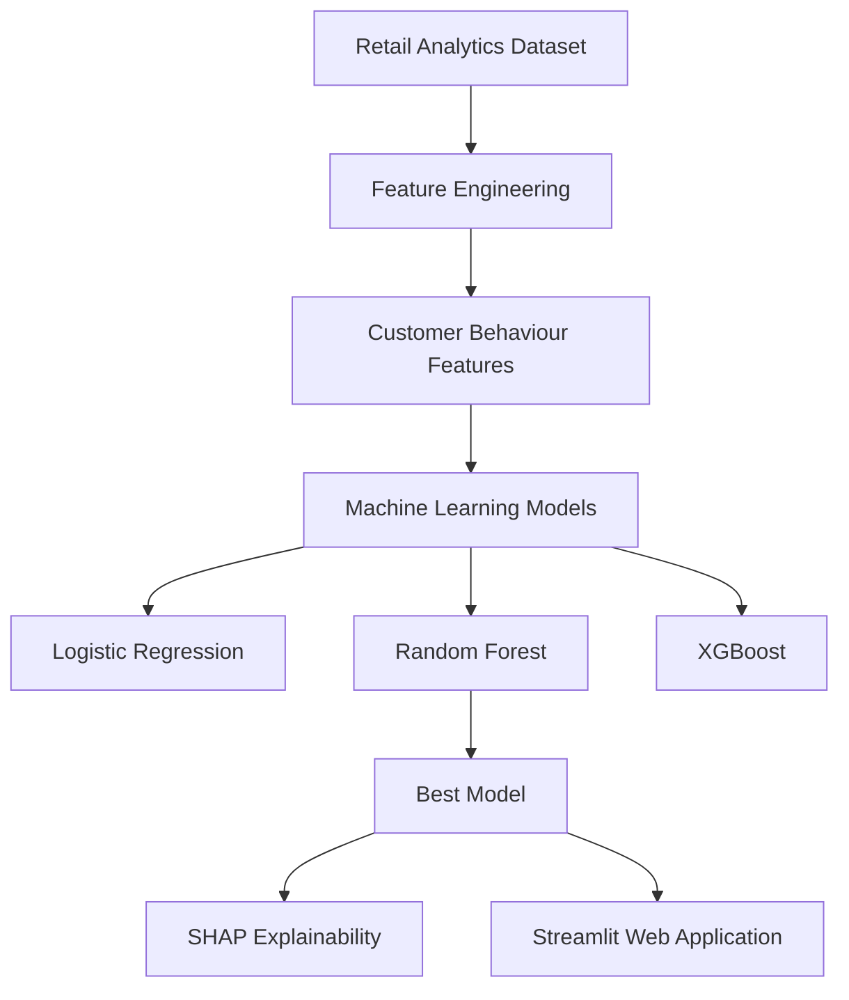

# 🛍️ Retail Customer Intelligence: Future High-Value Customer Prediction


---

## 📌 Project Overview

This project demonstrates an **end-to-end machine learning pipeline** for predicting **future high-value customers** using historical purchasing behaviour.

Instead of relying solely on descriptive analytics, this project applies predictive analytics to identify customers who are likely to become valuable in the future. The solution integrates **feature engineering, machine learning, explainable AI (SHAP), and Streamlit deployment** to provide transparent and actionable predictions.

This project reuses the analytical dataset generated from my previous project:

➡️ **Retail Data Engineering Pipeline**

---

## 🌐 Live Demo

🚀 **Try the deployed application here:**

**https://retail-ai-aqilah-bze9g2anaxhjfage.eastasia-01.azurewebsites.net**

The application is deployed on **Microsoft Azure App Service** with **GitHub Actions** for automated CI/CD deployment.

---

## 🎯 Business Problem

Retail companies often have limited marketing budgets and cannot provide premium promotions to every customer.

The objective of this project is to identify customers who are likely to become **future high-value customers**, enabling businesses to:

- Target personalized marketing campaigns
- Improve customer retention
- Prioritize loyalty rewards
- Optimize promotional spending

---

## 🏗️ System Architecture



---

## 🚀 Technologies Used

- Python
- Pandas
- NumPy
- Scikit-Learn
- XGBoost
- SHAP
- Joblib
- Streamlit
- Matplotlib

---

## 📂 Project Structure

```text
retail-customer-prediction/

│
├── app/
│   └── app.py
│
├── data/
│   ├── analytics_sales.csv
│   ├── customer_future_features.csv
│   ├── X_train.csv
│   ├── X_test.csv
│   ├── y_train.csv
│   └── y_test.csv
│
├── models/
│   └── best_model.pkl
│
├── notebook/
│   ├── 01_prepare_future_prediction_dataset.ipynb
│   ├── 02_feature_engineering.ipynb
│   ├── 03_model_training.ipynb
│   └── 04_model_explainability.ipynb
│
├── screenshots/
│
├── requirements.txt
│
└── README.md
```

---

## 📊 Feature Engineering

Customer-level features were generated from transactional data, including:

- Historical Revenue
- Total Orders
- Purchase Frequency
- Historical Average Order Value
- Total Quantity Purchased
- Average Items per Order
- Customer Tenure
- Days Since Last Purchase
- Membership Tier
- Favourite Product Category
- Preferred Payment Method
- Customer Demographics

---

## 🎯 Target Variable

Because this project uses synthetic retail data, a **synthetic future customer value score** was generated using business-inspired behavioural assumptions.

The score incorporates:

- Historical customer spending
- Purchase frequency
- Customer engagement
- Membership tier
- Purchase recency
- Controlled random variation

Customers within the **top 25%** of the generated future value score were labelled as **Future High-Value Customers**.

This approach creates a realistic supervised learning scenario for demonstrating end-to-end machine learning while remaining transparent about the synthetic nature of the dataset.

---

## 🤖 Machine Learning Models

Three classification models were evaluated.

| Model | Accuracy | Precision | Recall | F1 Score | ROC-AUC |
|--------|---------:|----------:|--------:|---------:|--------:|
| Logistic Regression | 91.3% | 0.800 | 0.870 | 0.833 | 0.969 |
| Random Forest ⭐ | **96.7%** | **1.000** | **0.870** | **0.929** | **0.989** |
| XGBoost | 94.6% | 0.909 | 0.870 | 0.889 | 0.982 |

Random Forest achieved the best overall performance and was selected for deployment.

---

## 🔍 Explainable AI

To improve model transparency, **SHAP (SHapley Additive exPlanations)** was applied to interpret prediction results.

SHAP provides:

- Global feature importance
- Local explanations for individual customers
- Transparent interpretation of model predictions

### Global Feature Importance


---

### SHAP Summary Plot


---

### Local Customer Explanation


---

## 💻 Streamlit Application

An interactive Streamlit application was developed to demonstrate real-time prediction.

Users can input customer information including:

- Age
- Membership Tier
- Purchase Frequency
- Historical Spending
- Total Orders
- Customer Tenure

The application predicts:

- Future High-Value Customer
- Prediction Probability


---

## ⚙️ Installation

Clone the repository

```bash
git clone https://github.com/yourusername/retail-customer-prediction.git

cd retail-customer-prediction
```

Install dependencies

```bash
pip install -r requirements.txt
```

Launch Streamlit

```bash
streamlit run app/app.py
```

---

## 📈 Future Improvements

Potential future enhancements include:

- Containerize the application using Docker
- Deploy using Azure Container Apps or Kubernetes
- Build an automated MLOps pipeline
- Real-time prediction using Kafka
  
---

## 🔗 Related Project

This project uses the analytical dataset generated by my previous repository:

➡️ **Retail Data Engineering Pipeline**

The previous project demonstrates:

- Synthetic retail data generation
- PostgreSQL data warehouse
- Apache Spark ETL
- SQL analytics
- Tableau dashboard development

Together, both projects demonstrate a complete **data engineering → analytics → machine learning → explainable AI workflow**.

---

## 👤 Author

**Aqilah Syahirah*

Master of Science (Computer Science)

Interested in Machine Learning, Explainable AI, Data Engineering, Computer Vision and Applied AI.
